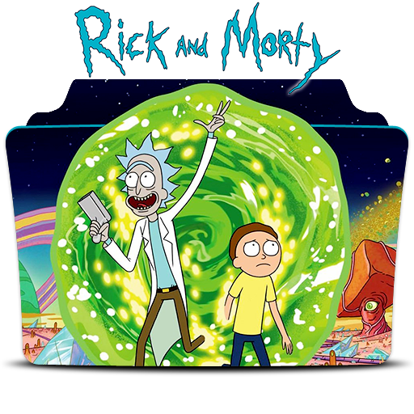

  <h1>
     
     
    
     
    <a href="https://practical-swanson-a56b9a.netlify.app/" target="_blank">
        Rick and morty characters explorer
    </a>
     
     
     
     
  </h1>
  
      
      
        
  
   
   
   
   
  <pre>yarn install && yarn dev</pre>
   
   
   
   
   

